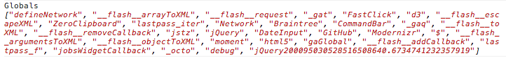

# log-globals

> Logs your global variables to the console

Useful for finding leaked global variables.




## Getting started

Can be used as a bookmarklet or a [DevTools snippet](https://github.com/bgrins/devtools-snippets#to-enable-devtools-snippets-in-chrome).


### Bookmarklet

```js
javascript:console.log(function(){var a=document.createElement("iframe");a.style.display="none";document.body.appendChild(a);var c=a.contentWindow;document.body.removeChild(a);var a=Object.create(null),b;for(b in window)b in c||(a[b]=window[b]);return a}())
```


## License

MIT © [Sindre Sorhus](http://sindresorhus.com)
